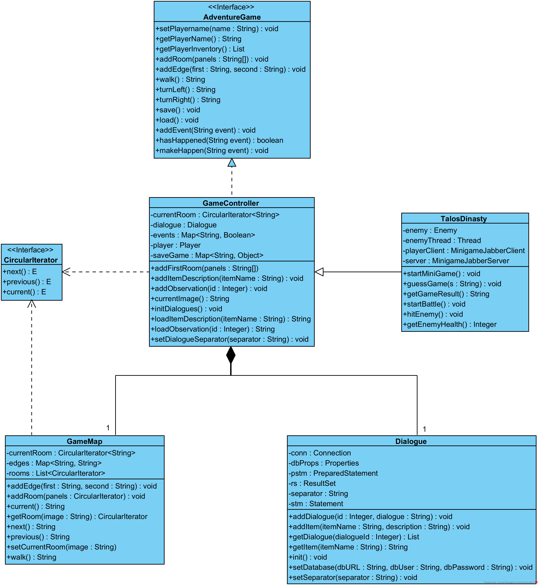
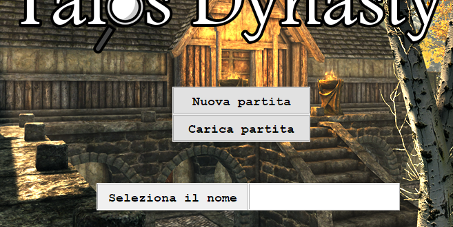
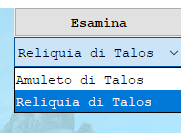
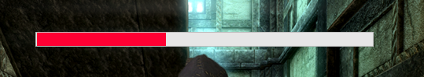
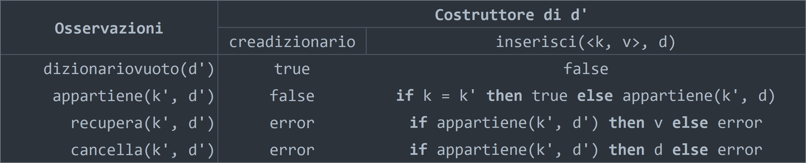
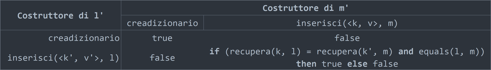
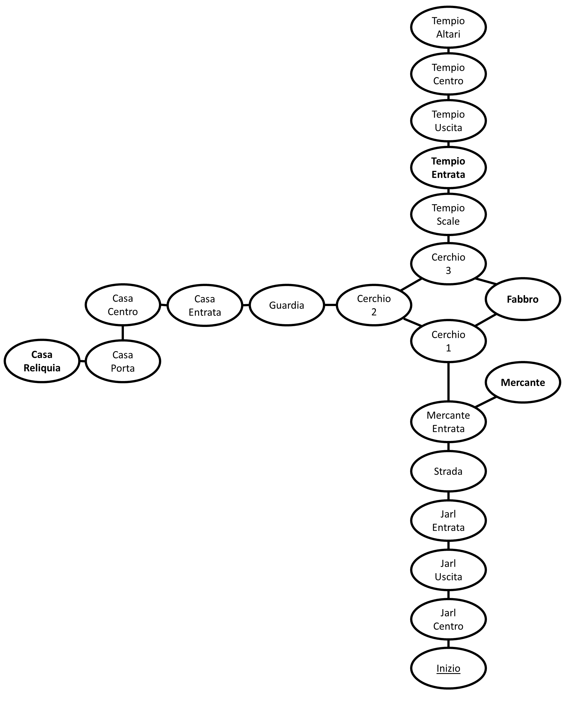

# 
Autore: Francesco Musci

# Indice
1. [Introduzione](#introduzione)

	1.1. [Tutorial](#tutorial)

2. [Architettura del sistema](#architettura-del-sistema)

	2.1. [Struttura dei package e delle classi](#struttura-dei-package-e-delle-classi)<br>
		&nbsp;&nbsp;&nbsp;&nbsp;2.1.1. [Package `view`](#package-view)<br>
		&nbsp;&nbsp;&nbsp;&nbsp;2.1.2. [Package `model`](#package-model)<br>
		&nbsp;&nbsp;&nbsp;&nbsp;2.1.3. [Package `game`](#package-game)<br>
		&nbsp;&nbsp;&nbsp;&nbsp;2.1.4. [Package `util`](#package-util)<br>

	2.2. [Diagramma UML delle classi](#diagramma-uml-delle-classi)

3. [Dettagli implementativi](#dettagli-implementativi)

	3.1. [Tecnologie utilizzate](#tecnologie-utilizzate)<br>
		&nbsp;&nbsp;&nbsp;&nbsp;3.1.1. [File](#file)<br>
		&nbsp;&nbsp;&nbsp;&nbsp;3.1.2. [Database](#database)<br>
		&nbsp;&nbsp;&nbsp;&nbsp;3.1.3. [Socket/Net](#socketnet)<br>
		&nbsp;&nbsp;&nbsp;&nbsp;3.1.4. [Thread](#thread)<br>
		&nbsp;&nbsp;&nbsp;&nbsp;3.1.5. [Swing/GUI](#swinggui)<br>
		&nbsp;&nbsp;&nbsp;&nbsp;3.1.6. [Espressioni lambda](#espressioni-lambda)<br>

4. [Specifica algebrica: dizionario](#specifica-algebrica-dizionario)

	4.1. [Specifica sintattica](#specifica-sintattica)

	4.2. [Specifica semantica](#specifica-semantica)

5. [Soluzione (spoiler)](#soluzione-spoiler)

# Introduzione
Il seguente materiale costituisce la documentazione per il progetto per l'esame di Metodi Avanzati di Programmazione (2021). Il progetto, volto ad utilizzare i concetti e i metodi appresi durante il corso, consiste in un videogioco di tipo avventura grafica o testuale. In questo caso, si tratta di un'avventura grafica.

"Talos Dynasty" è un'avventura grafica ispirata a [Myst](https://it.wikipedia.org/wiki/Myst) e ambientata nel mondo di [The Elder Scrolls V: Skyrim](https://it.wikipedia.org/wiki/The_Elder_Scrolls_V:_Skyrim).
La scelta di questi due videogiochi non è casuale. In primo luogo perché il gameplay del primo e l'ambientazione del secondo si prestano bene ad essere riutilizzati per creare un gioco con Java Swing; in secondo luogo perché l'autore apprezza molto questi due titoli.

Il gioco inizia con lo Jarl (un "sindaco" nell'universo di Skyrim) che ti parla di un grave furto avvenuto in città. Il tuo compito è quello di risolvere il mistero e restituire il maltolto.

## Tutorial
All'avvio dell'applicazione comparirà la schermata iniziale, in cui si potrà scegliere se iniziare una nuova partita o caricarne una in corso.

**Nuova partita**: inizierà una nuova partita, previo inserimento del nome del personaggio. Nel caso in cui non sia inserito un nome, verrà visualizzata una schermata di errore. Nel caso in cui sia già presente un nuovo salvataggio, viene mostrata una schermata che chiede all'utente se vuole sovrascrivere il precedente salvataggio o meno.

**Carica partita**: carica una partita salvata. Se non è presente alcuna partita salvata da caricare, verrà mostrato un messaggio d'errore.

Iniziato il gioco, per interagire con l'ambiente circostante è sufficiente cliccarci. Per muoversi, invece, si dovrà cliccare ai bordi dello schermo: bordo superiore per andare avanti in una direzione; bordi sinistro e destro per voltare il personaggio nella rispettiva direzione.

In alto a sinistra, il pulsante **Salva ed esci** salva il gioco e chiude il processo. In alto a destra, un menù a tendina contiene l'inventario del personaggio; il pulsante **Esamina** consente di esaminare l'oggetto selezionato nel menù a tendina.

Il testo dei dialoghi è mostrato in un riquadro in basso al centro della schermata. Per andare avanti con le frasi del dialogo, è necessario cliccare il riquadro. Quando scompare, vuol dire che non ci sono più frasi in quella interazione.

# Architettura del sistema
Il progetto implementa il pattern architetturale *Model-View-Presenter*. La logica di gioco (*Model*) e l'interfaccia che la implementa (*View*) non possono interagire tra loro in maniera diretta: il *Presenter* è un mediatore che si occupa di prendere in input i comandi e i dati della *View* e inviarli al *Model*, e viceversa. Questa architettura garantisce il rispetto di uno degli obiettivi dell'object-oriented design: la presentazione separata.

Il sistema è progettato per essere esteso e semplice da utilizzare per un eventuale utente che lo estenderà per progettare il suo gioco. Nel progetto, la classe `Game` estende la classe `GameController` per usufruirne e per aggiungere ulteriori funzionalità.

## Struttura dei package e delle classi

### Package `view`

* `GameGUI`: l'interfaccia di gioco.

### Package `model`

Contiene le classi centrali al funzionamento del sistema.

* `AdventureGame`: interfaccia che descrive il comportamento che dovranno avere le classi che realizzano un gioco di questo tipo.
* `Dialogue`: contiene i metodi per popolare, leggere e connettersi a un database SQL mediante la libreria H2.
* `GameMap`: contiene la mappa del gioco e i metodi per crearla e navigarci.
* `GameController`: implementa l'interfaccia `AdventureGame` contiene la logica principale del gioco. Aggrega le altre classi del package `model` e le coordina, implementando così il *Façade* design pattern, ovvero fornendo un'interfaccia semplice e unificata a fronte di un sistema complesso.

### Package `game`

Contiene classi aggiuntive che implementano funzionalità proprie del gioco.

* `Enemy`: combattimento finale.
* `MinigameJabberClient`: client per il minigioco numerico.
* `MinigameJabberServer`: server per il minigioco numerico.
* `Game`: classe principale che si occupa di interfacciarsi con le altre classi e di istanziarle. Anche qui viene implementato il *Façade* design pattern.

### Package `util`

Contiene la descrizione della struttura dati "iteratore circolare", che consente di iterare ciclicamente su una lista di elementi (ovvero: l'elemento che segue l'ultimo elemento è il primo elemento; l'elemento che precede il primo elemento è l'ultimo elemento).

* `CircularIterator`: interfaccia per la struttura dati "iteratore circolare".
* `CircularArrayList`: implementazione di `CircularIterator` che si avvale della struttura dati preesistente `ArrayList`, estendendola.

## Diagramma UML delle classi
Di seguito è riportato il diagramma UML delle classi (comprende solo una porzione significativa delle classi).



# Dettagli implementativi

La mappa di gioco è composta da stanze. Ciascuna stanza è a sua volta composta da delle immagini. Queste immagini sono raccolte in un iteratore circolare, in modo da simulare il movimento continuo della visuale in prima persona. Ciascuna immagine è associata a uno o più eventi; ogni volta che il giocatore si muove e l'immagine viene aggiornata, viene effettuato un controllo per capire quali sono gli eventi associati all'immagine visualizzata ed eseguirli.

Per determinare il movimento da una stanza all'altra, bisogna definire i collegamenti tra le immagini: l'immagine di partenza, quella che il giocatore sta guardando, e l'immagine di destinazione, quella che il giocatore guarderà una volta terminato il movimento. Ottenuta l'immagine di destinazione, viene cercata nella mappa la stanza che contiene l'immagine di destinazione e viene impostata come stanza corrente.

Questa architettura permette di eliminare il vincolo di dover definire a priori il numero di direzioni in cui il giocatore può andare e che può osservare (ad es. nord, sud, est, ovest).

Particolare è la creazione dell'interfaccia **iteratore circolare**. Si tratta di un iteratore in cui l'elemento che segue l'ultimo elemento è il primo elemento e l'elemento che precede il primo elemento è l'ultimo elemento. Nel progetto è presente l'interfaccia `CircularIterator`, che fa utilizzo delle generics, e anche una sua possibile implementazione: `CircularArrayList`.

## Tecnologie utilizzate

### File

L'input/output con i file è utilizzato per salvare i dati della partita. Per ricostruire una partita a partire da un salvataggio sono necessari quattro oggetti:
* immagine corrente 
* nome del personaggio
* inventario
* eventi.

A tal proposito è stata scelta la rappresentazione in JSON dei dati utilizzando la libreria Gson. Per raccogliere i dati all'interno di un'unico oggetto, i dati sono memorizzati all'interno di una HashMap: le chiavi, di tipo String, sono i nomi degli attributi; i valori, di tipo Object, sono gli attributi memorizzati. Si noti che quando è il momento di caricare i dati da file, è necessario effettuare un typecasting dal tipo Object.

Qui di seguito, un esempio di un possibile salvataggio:
```javascript
{
	"currentImage":"jarl_n.png",
	"name":"Tizio",
	"inventory":["Anello d'oro"],
	"events":{"KID_EVENT":true,"ENEMY_EVENT":false}
}
```

Utilizzando la serializzazione standard di Java si sarebbero salvati tanti altri dati non utili; per ovviare a questo problema l'utilizzo del modificatore `transient` non sarebbe stato ottimale, poiché, dovendo usarlo spesso in vari punti del codice, ne avrebbe intaccato la leggibilità e l'estendibilità. Data la semplicità e la quantità minima di dati da memorizzare in questo caso, la rappresentazione JSON è più adatta.

### Database

I database sono utilizzati per memorizzare i dialoghi all'interno del gioco mediante il DBMS H2. Data l'ottica di riusabilità del codice, è possibile decidere a quale database connettersi, potendo definire URL, username e password. I dialoghi hanno un id e un testo, sono creati in questo modo:
```sql
CREATE TABLE IF NOT EXISTS dialoghi (id INT NOT NULL PRIMARY KEY, text VARCHAR)
```

Questa implementazione dei database presenta una particolarità: l'implementazione di un sistema di partizionamento dei dialoghi. Quando un dialogo è troppo lungo per essere mostrato per intero nel riquadro, l'utente può inserire nella stringa un separatore (di sua scelta) che separa i diversi pezzi del dialogo, che vengono restituiti in una lista. Nel progetto, viene preso l'iteratore della lista per effettuare l'avanzamento del dialogo.

Un esempio dell'utilizzo del separatore:
> Ottimi gusti.§Grazie per l'acquisto!

In questo caso, il separatore scelto è `§`.

### Socket/Net
La programmazione in rete è utilizzata per implementare il minigioco [Bulls and Cows](https://en.wikipedia.org/wiki/Bulls_and_Cows). Si gioca in due: un giocatore pensa ad un numero e l'altro deve indovinarlo, sulla base di un insieme di regole. Questo minigioco si presta ad essere implementato mediante l'architettura client/server: il client è il giocatore che effettua il tentativo; il server è il giocatore che "pensa" al numero e verifica l'esito dei tentativi dell'altro giocatore.

Un tipico scenario di funzionamento è il seguente:
1. Il server viene avviato.
2. Il server si mette in attesa di una connessione da un client.
3. Il client si connette.
4. Il server genera il numero da indovinare.
5. Il server si mette in attesa del tentativo del client.
6. Il client effettua il tentativo.
7. Il server determina l'esito del tentativo.
8. Il server manda l'esito in output al client.
9. Il client riceve in input l'esito.
10. Esito:
	1. Se il giocatore ha vinto, il server termina la sua esecuzione;
	2. Se il giocatore ha ancora dei tentativi rimasti, ritorna al punto 5;
	3. Se il giocatore ha perso e non ha più tentativi rimasti, ritorna al punto 4.

In questo caso, avviene tutto in locale: client e server sono eseguiti sulla stessa macchina, utilizzando la porta `6666`.

### Thread
I thread sono utilizzati in due occasioni.

La prima è per eseguire il server visto al punto precedente.

La seconda è per la gestione della battaglia finale col nemico. In questa battaglia il nemico rigenera costantemente i suoi punti vita. Per cui, il giocatore dovrà colpirlo velocemente abbastanza da portare i suoi punti vita a zero.

La rigenerazione avviene attraverso un thread che incrementa i punti vita di 1 ogni 10 millisecondi. L'attacco del giocatore avviene su pressione del pulsante, che toglie al nemico 12 punti vita. Poiché la modifica dei punti vita non è un'operazione atomica, potrebbero sorgere problemi dovuti all'interleaving, e delle modifiche potrebbero andare perse. Il problema è stato risolto con l'utilizzo del modificatore `synchronized` applicato alla funzione che si occupa di modificare i punti vita.

Tuttavia, sorge un ulteriore problema. Un thread incrementa i punti vita del nemico e un altro thread li legge per visualizzarli nell'interfaccia: per via di alcune ottimizzazioni, il thread che legge la variabile che contiene i punti vita potrebbe non leggere un valore corretto. Per risolvere questo problema è stato applicato il modificatore `volatile` alla variabile che contiene i punti vita, che garantisce la consistenza della memoria in ambito thread.

### Swing/GUI
Per l'interfaccia è stato utilizzato il framework Swing.

Il `JFrame` è il punto d'ingresso del sistema. Ha dimensioni 1280x720 e non è ridimensionabile.

L'interfaccia di gioco è strutturata in modo tale che i pulsanti e gli altri elementi necessari all'interazione col gioco siano collocati in primo piano rispetto all'immagine di gioco, collocata sullo sfondo. Per implementare questa struttura è stato utilizzato un `jLayeredPane`, che stabilisce una relazione d'ordine sulla stratificazione delle componenti.


> Dettaglio della schermata iniziale, che mostra i pulsanti in primo piano e l'immagine sullo sfondo.

I `jLabel` sono strumenti molto flessibili: sono utilizzati sia per mostrare il testo che per mostrare immagini. Per l'inventario è utilizzato un menù a tendina, una `jComboBox`.


> Esempio di inventario.

Diversi eventi nel gioco necessitano di diversi pulsanti, dunque è necessario un modo per selezionare all'occorrenza un determinato gruppo di pulsanti. Per ottenere questo risultato è stato usato un `jPanel` con layout `CardLayout`. In questo layout, ciascuna "card" è un gruppo di pulsanti e altre componenti. Ad ogni cambio di immagine viene verificato qual è il layout corrispondente.

Un utilizzo "dinamico" dell'interfaccia viene fatto durante il combattimento finale, in cui una `jProgressBar` indica i punti vita del nemico.



La `jProgressBar` è stata privata del bordo e colorata di rosso per rendere meglio l'effetto di una tipica barra della vita che si trova nei videogiochi.

Tutti i contenitori (`jPanel`, `jLayeredPane`) utilizzano il `null` layout, che permette un posizionamento libero dei componenti.

### Espressioni lambda
Le espressioni lambda sono utilizzate in modo sparso per il codice con il `.forEach()`, che permette una scrittura più compatta del classico costrutto `for each`.

In particolare, è utilizzata un'espressione lambda per cercare una stanza. L'espressione è la seguente:
```java
rooms.stream().filter(ci -> (ci.contains(image))).forEach(ci -> {
    currentRoom = ci;
});
```
Si tratta di una pipeline. Dato lo stream, viene filtrata la stanza che contiene l'immagine data in input. Una volta trovata, viene assegnata alla variabile di ritorno.

# Specifica algebrica: dizionario

## Specifica sintattica

**Sorts:** dizionario; boolean; valore

**Operazioni:**

```
creadizionario		() 				-> dizionario	Crea un nuovo dizionario.

inserisci		(dizionario, <chiave, valore>) 	-> dizionario	Inserisce nel dizionario un valore associato ad una chiave.

cancella		(dizionario, chiave) 		-> dizionario	Cancella dal dizionario un valore associato ad una chiave.

dizionariovuoto		(dizionario) 			-> boolean	Determina se il dizionario è vuoto.

appartiene		(dizionario, chiave) 		-> boolean	Determina se una chiave appartiene al dizionario.

recupera		(dizionario, chiave) 		-> valore	Restituisce il valore associato ad una chiave.
```

## Specifica semantica
**Declare:** d: dizionario; k: chiave; v: valore



`equals(l, m)`


# Soluzione (spoiler)
Per finire direttamente il gioco, aprire il file `saveGame.json` e aggiungere all'inventario "Reliquia di Talos", dopodiché parlare con lo Jarl.

Per completare il gioco passo per passo, leggere la seguente guida. Di seguito, una mappa per agevolare la soluzione.


	
Partendo da _Inizio_, girarsi dalla parte opposta dello Jarl e andare in _Tempio Altari_. Si troverà una pergamena, cliccarci sopra.

Girarsi e andare in _Tempio Entrata_: ci sarà una bambina che proporrà un gioco. Per risolvere direttamente questo gioco si può aprire `saveGame.json` e aggiungere all'inventario "Anello d'oro"; oppure, si può modificare il codice scrivendo da qualche parte l'istruzione `addItem(Game.GOLDEN_RING);` (in particolare, basta rimuovere il commento dalla riga 670 di `GameGUI.java`).

Ottenuto l'anello d'oro, andare dal _Fabbro_. Cliccando sul fabbro, aggiungerà all'inventario una moneta d'oro.

Andare dal _Mercante_, cliccare sull'amuleto a sinistra che aggiungerà all'inventario l'amuleto di Talos (cliccare sul libro a destra per un piccolo _easter egg_).

A questo punto, andare in _Casa Porta_. Inizierà la battaglia col nemico. Cliccare sul nemico, esaurire il dialogo e premere velocemente il pulsante col simbolo del pugno per uccidere il nemico. Ucciso il nemico, voltarsi a destra e prendere la reliquia di Talos.

Tornare dallo Jarl (_Inizio_) e parlarci. Il gioco terminerà.
